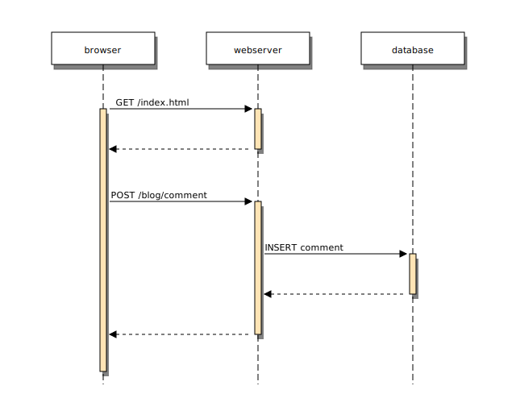

<!-- _class: titlepage-->

# Today's Topic in HUST
## subtitle about something blablabla
### yuxin yang
#### 03.Mar.2000
##### DSAL in HUST

---


# 目录
<div>
      
<!-- _class: cool-list -->

1. *图片测试*
2. *公式测试*
3. *表格测试*
4. *代码测试* 
5. *文字格式测试*
6. *特殊符号测试*
   
</div>  


---
<!-- class: model1 -->

# 图片测试

## 1.browser

- 前端设计部分
## 2.webserver

- 服务端设计部分
## 3.database 

- 数据库设计部分



<!-- 大家好，我是 -->

---

# 公式测试

行内公式 $\sigma{1,2,3}$

行间公式：

$$

D(x) = \begin{cases}
\lim\limits_{x \to 0} \frac{a^x}{b+c}, & x<3 \\
\pi, & x=3 \\
\int_a^{3b}x_{ij}+e^2 \mathrm{d}x,& x>3 \\
\end{cases} 

$$
---

# 表格测试

| Column A | Column B | Column C | Column D |
| -------- | -------- | -------- | :------: |
| A1       | B1       | C1       |    D1    |
| A2       | B2       | C2       |    D2    |
| A3       | B3       | C3       |    D3    |

---

# 代码测试

``` C++
//c++ code 
#include<iostream.h>
#include<string.h>
using namespace std;

int main(
    cout<<"hello world!";
    return 0;
)

```

---

# 文字格式测试 如何在标题1进行字体 **加粗**?
 
这是一段正文，这是一段正文，这是一段正文。   
     
- 这是一个子结论，这是一个子结论。 

这是一段新的**正文测试**，这是一段新的正文测试，这是一段新的正文测试，这是一段新的正文测试:
- 如何在正文部分进行字体加粗: **字体加粗**!   
- 如何在正文部分进行文字高亮: _高亮文本_!  
   
> ***Note**: 这是一段长脚注，这是一段长脚注。

---

<div class="columns">            
<div> 
 
# H1
## H2 
### H3 
#### H4
##### H5
###### H6
</div>
<div>
 
- 分栏测试
 
- 分栏测试

  - This is one **feature**
  - This is another subjetc.
 
</div>
</div>

---

# 特殊符号测试

:+1: :-1: :smile: :heart: :cry: :sob: :a: :b: :angry: :grin: :tongue: :ru: :us: :cn:
##### 需要了解更多的表情的简写，可以查阅[链接](https://gist.github.com/rxaviers/7360908)

---

# 感谢
